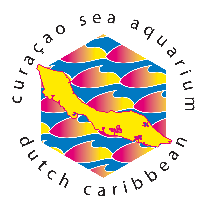
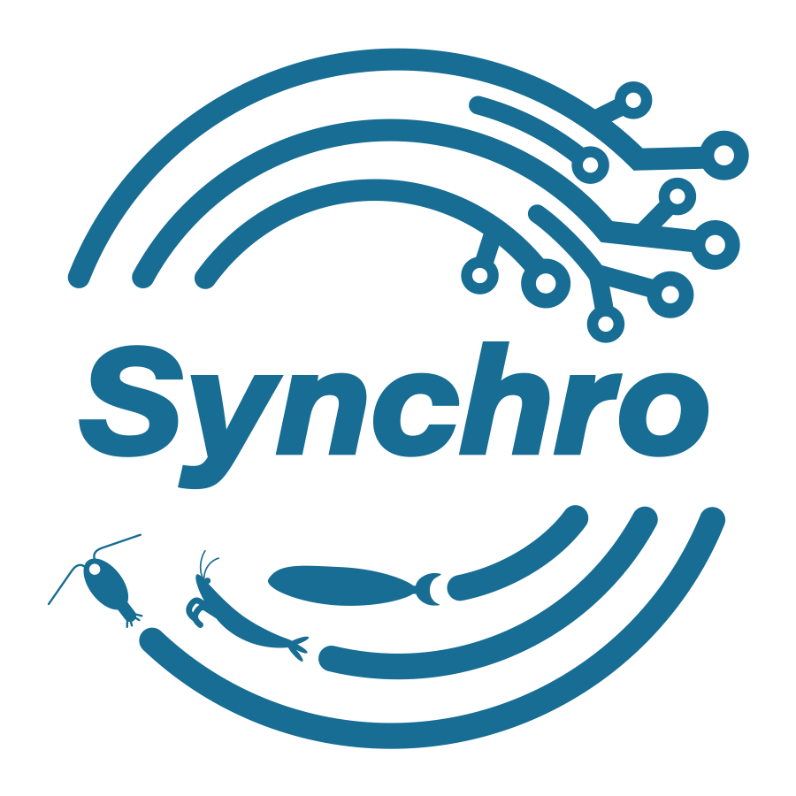

# FinDrop-Beta
Welcome to the FinDrop-Beta repository where we will work together to submit feature requests or to raise issues with either the software or firmware. We will work as quickly as possible to get you up and running with FinDrop, so you have a reliable experience. 

## GUI OS Compatibility 

FinDrop UI is now switched to be an installable WebApp: [FinDropUI](https://fisheye-collaborative.github.io/FinDrop/)

It is recommended to use Chrome, other browsers have not been thoroughly tested.

# Manuals
You can find the detailed user manuals for the hardware and software of FinDrop at the following link:

- [Hardware Manual](https://github.com/FishEye-Collaborative/FinDrop-Beta/blob/main/User%20Manual-%20FinDrop%20TRL6.pdf)
- Software Manual - coming soon!

## 🤝 Collaborators & Sponsors

### Collaborators

  
  

### Advisors

  

### Sponsors

  
  
  

