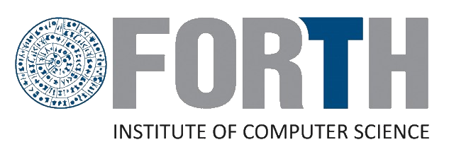

# FinDrop-Beta
Welcome to the FinDrop-Beta repository where we will work together to submit feature requests or to raise issues with either the software or firmware. We will work as quickly as possible to get you up and running with FinDrop, so you have a reliable experience. 

# Installation

Grab the latest version for your operating system (Mac/Windows/Linux) here:  
- [Download FinDrop v1.0](https://github.com/FishEye-Collaborative/FinDrop-Beta/releases/tag/v1.0.1)

## GUI OS Compatibility 

FinDrop is built for the following platforms:

| Platform       | OS Version            | Status       | 
|----------------|------------------------|--------------|
| **Windows**    | 10 (64-bit)           | ✅ [Supported](https://github.com/FishEye-Collaborative/FinDrop-Beta/releases/download/v1.0.1/FinDrop-windows-latest.zip) | 
|                | 11                    | ✅ [Supported](https://github.com/FishEye-Collaborative/FinDrop-Beta/releases/download/v1.0.1/FinDrop-windows-latest.zip) |
| **macOS**      | 13 Ventura            | ✅ [Supported](https://github.com/FishEye-Collaborative/FinDrop-Beta/releases/download/v1.0.1/FinDrop-macos-13.zip) |
|                | 14 Sonoma (latest)    | ✅ [Supported](https://github.com/FishEye-Collaborative/FinDrop-Beta/releases/download/v1.0.1/FinDrop-macos-13.zip) | 
| **Linux**      | Ubuntu 22.04          | ✅ [Supported](https://github.com/FishEye-Collaborative/FinDrop-Beta/releases/download/v1.0.1/FinDrop-ubuntu-latest.zip) | 
|                | Ubuntu 18.04          | ✅ [Supported](https://github.com/FishEye-Collaborative/FinDrop-Beta/releases/download/v1.0.1/FinDrop-ubuntu-18.04.zip) |  

> ℹ️ If you run into issues with these builds or need builds for ARM (e.g., Raspberry Pi), or other platforms, please open an issue!

# Manuals

## 🤝 Collaborators & Sponsors

### Collaborators

  
  

### Sponsors

  
  
  
  

